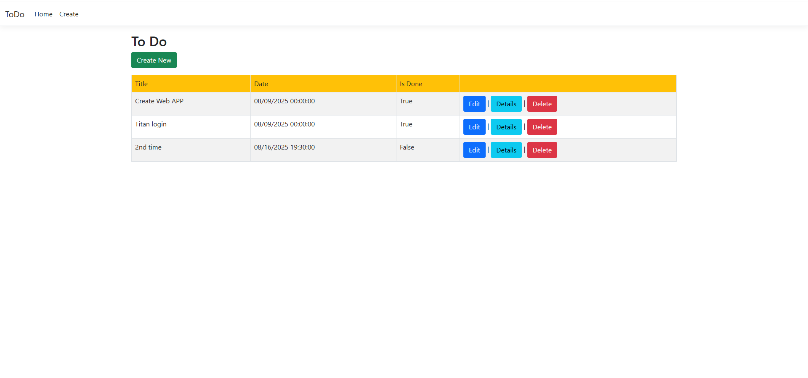

<!DOCTYPE html>
<html lang="en">
<head>
  <meta charset="UTF-8" />

</head>
<body>
  <h1>📝 To-Do List Web Application</h1>
  

    A simple and efficient CRUD To-Do List app built with C# .NET Core MVC, containerized with Docker using a multi-stage build, deployed on AWS EKS, and integrated with SQL Server Integration Services (SSIS) for powerful data workflows.
  

  <blockquote>
    🚀 This project is adapted from an open-source repo and significantly enhanced for production-ready cloud deployment with automated database migrations and container orchestration.
  </blockquote>

  <h2>📂 Repository</h2>
  

    Full source code available at: 
    <a href="https://github.com/alokraja075/alokraja075-ToDoList-MVC-.NET/blob/master/README.md?plain=1" target="_blank" rel="noopener noreferrer">
      https://github.com/alokraja075/alokraja075-ToDoList-MVC-.NET
    </a>
  

  <h2>🖼️ Screenshot</h2>
  
Here's a preview of the application running locally:

  

  <h2>🛠️ Table of Contents</h2>
  <ul>
    <li><a href="#prerequisites">Prerequisites</a></li>
    <li><a href="#getting-started">Getting Started</a></li>
    <li><a href="#features">Features</a></li>
    <li><a href="#usage">Usage</a></li>
    <li><a href="#docker-support">Docker Support</a></li>
    <li><a href="#deployment-on-aws-eks">Deployment on AWS EKS</a></li>
    <li><a href="#ssis-integration">SSIS Integration</a></li>
    <li><a href="#contributing">Contributing</a></li>
    <li><a href="#license">License</a></li>
  </ul>

  <h2 id="prerequisites">⚙️ Prerequisites</h2>
  <ul>
    <li>Visual Studio or your favorite IDE</li>
    <li><a href="https://dotnet.microsoft.com/download" target="_blank" rel="noopener noreferrer">.NET Core SDK</a></li>
    <li>A relational database (SQL Server, SQLite, etc.)</li>
    <li><a href="https://www.docker.com/products/docker-desktop" target="_blank" rel="noopener noreferrer">Docker Desktop</a></li>
    <li>AWS CLI and <code>kubectl</code> configured for EKS</li>
  </ul>

  <h2 id="getting-started">🚀 Getting Started</h2>
  <ol>
    <li>Clone the repository:
      <pre><code>git clone https://github.com/alokraja075/alokraja075-ToDoList-MVC-.NET.git</code></pre>
    </li>
    <li>Open the project in Visual Studio or your preferred editor</li>
    <li>Update your database connection string in <code>appsettings.json</code> if needed (the Docker Compose file sets this automatically)</li>
    <li>Run EF Core migrations to set up the database schema (optional if using Docker Compose):
      <pre><code>dotnet ef migrations add InitialCreate
dotnet ef database update</code></pre>
    </li>
    <li>Start the app and database with Docker Compose (recommended):
      <pre><code>docker-compose up --build</code></pre>
      
This command builds the app image using a <strong>multi-stage Dockerfile</strong> that restores dependencies, compiles, publishes the app, and prepares a startup script to automatically run migrations before launching.

    </li>
  </ol>

  <h2 id="features">✨ Features</h2>
  <ul>
    <li>✅ View all To-Do items</li>
    <li>✏️ Create new To-Do items</li>
    <li>🔍 View item details</li>
    <li>✍️ Edit existing items</li>
    <li>🗑️ Delete items with confirmation</li>
    <li>🚀 Fully containerized with automated database migrations</li>
    <li>🐳 Docker Compose orchestrates app and SQL Server containers with health checks and dependency management</li>
    <li>☁️ Kubernetes manifests for deployment on AWS EKS</li>
    <li>🔄 SSIS integration for advanced ETL and automation workflows</li>
  </ul>

  <h2 id="usage">💻 Usage</h2>
  

    The application runs on port <strong>8080</strong> by default. 
    Start the full stack using Docker Compose:
    <pre><code>docker-compose up --build</code></pre>
    This will:
    <ul>
      <li>Build the .NET app using a multi-stage Dockerfile</li>
      <li>Start an MS SQL Server container with a secure SA password and health checks</li>
      <li>Ensure the app waits for the database to be healthy before running migrations and starting</li>
      <li>Expose the app at <a href="http://localhost:8080" target="_blank" rel="noopener noreferrer">http://localhost:8080</a></li>
    </ul>
  

  
<strong>Stopping the app:</strong>

  <pre><code>docker-compose down</code></pre>

  <h2 id="docker-support">🐳 Docker Support</h2>
  

    The <strong>Dockerfile</strong> uses a multi-stage build:
  

  <ul>
    <li><strong>Build stage:</strong> Uses the .NET SDK image to restore dependencies, build, publish the app, and install EF Core tools.</li>
    <li><strong>Runtime stage:</strong> Copies the published output, installs EF Core tools, and sets up a startup script that waits for the database, runs migrations automatically, and then starts the app.</li>
  </ul>
  

    The <strong>docker-compose.yml</strong> defines two services:
  

  <ul>
    <li><code>db</code>: SQL Server 2019 container with environment variables for SA password and EULA acceptance, exposing port 1433, and a health check to ensure it's ready before the app starts.</li>
    <li><code>web</code>: The app container built from your Dockerfile, exposing port 8080, dependent on the healthy database container, and configured with environment variables including the connection string pointing to the <code>db</code> service.</li>
  </ul>

  <h2 id="deployment-on-aws-eks">☁️ Deployment on AWS EKS</h2>
  

    Kubernetes manifests and Helm charts included in this repo facilitate deployment on AWS Elastic Kubernetes Service (EKS). Use these for production-grade, scalable cloud hosting.
  

  <ul>
    <li>Configure AWS CLI and <code>kubectl</code> with your cluster credentials</li>
    <li>Deploy the manifests:
      <pre><code>kubectl apply -f k8s/</code></pre>
    </li>
    <li>Monitor pods and services:
      <pre><code>kubectl get pods
kubectl get svc</code></pre>
    </li>
  </ul>

  <h2 id="ssis-integration">🔄 SSIS Integration</h2>
  

    This project integrates SQL Server Integration Services (SSIS) to support advanced ETL workflows, data migration, and automation, complementing the core To-Do CRUD functionalities.
  

  
SSIS packages can be used to automate data processing tasks seamlessly alongside your application data.

  <h2 id="contributing">🤝 Contributing</h2>
  <ol>
    <li>Fork the repository</li>
    <li>Create a new branch for your feature or fix</li>
    <li>Make your changes and commit with clear messages</li>
    <li>Push to your fork</li>
    <li>Open a pull request against the main repo</li>
  </ol>

  <h2 id="license">📄 License</h2>
  
Specify your license here (e.g., MIT License).

  

  
Made with ❤️ by Alok Raja

</body>
</html>
